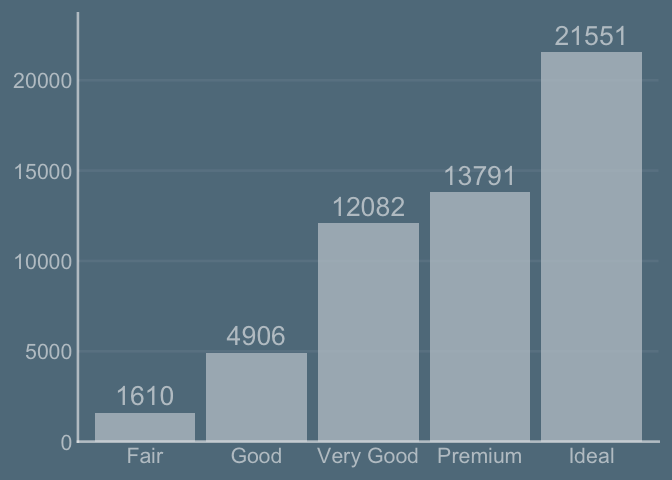

<!-- README.md is generated from README.Rmd. Please edit that file -->

# ggpro

<!-- badges: start -->
<!-- badges: end -->

The goal of ggpro is to …

## Installation

You can install the development version of ggpro from
[GitHub](https://github.com/) with:

``` r
# install.packages("devtools")
devtools::install_github("EvaMaeRey/ggpro")
```

## Example

This is a basic example which shows you how to solve a common problem:

``` r
library(tidyverse)
#> ── Attaching core tidyverse packages ──────────────────────── tidyverse 2.0.0 ──
#> ✔ dplyr     1.1.4          ✔ readr     2.1.5     
#> ✔ forcats   1.0.0          ✔ stringr   1.5.1     
#> ✔ ggplot2   3.5.1.9000     ✔ tibble    3.2.1     
#> ✔ lubridate 1.9.3          ✔ tidyr     1.3.1     
#> ✔ purrr     1.0.2          
#> ── Conflicts ────────────────────────────────────────── tidyverse_conflicts() ──
#> ✖ dplyr::filter() masks stats::filter()
#> ✖ dplyr::lag()    masks stats::lag()
#> ℹ Use the conflicted package (<http://conflicted.r-lib.org/>) to force all conflicts to become errors
```

``` r
# library(ggpro)
## basic example code


scale_x_bar_v <- function(drop = F, wrap = 15, labels = function(x){stringr::str_wrap(x, wrap)}, ...){
  
    scale_x_discrete(drop = drop, 
                     labels = labels)
  
}    

  
scale_y_bar_v <- function(expand = expansion(c(0, .1)), yaxis_title = "", labels = function(x){ifelse(x == max(x, na.rm = T), paste0("\n", x, "\n", yaxis_title), x)}, ...){
 
  scale_y_continuous(expand = expand, labels = labels, ...)
   
}


theme_bar_v <- function(){
  
  theme(axis.line.x = element_blank(),
             panel.grid.major.x = element_blank(),
             panel.grid.minor.x = element_blank(),
             panel.grid.minor.y = element_blank(),
             panel.grid.major.y = element_line(),
             axis.title = element_blank(),
             axis.ticks = element_blank(),
             panel.background = element_blank(),
             axis.line.x.bottom = element_line())
  
}


geom_bar_v <- function(yaxis = T, wrap = 15, yaxis_title = "", ...){
  
  list(geom_bar(...),
       theme_bar_v(),
       scale_x_bar_v(wrap = wrap),
       scale_y_bar_v(yaxis_title = yaxis_title),
       NULL
       )
  
}

geom_bar_v_label <- function(...){
  
  
  statexpress::qlayer(geom = statexpress::qproto_update(GeomLabel,
                                                        aes(vjust = 0, linewidth = 0, fill = NA)),
                      stat = statexpress::qproto_update(StatCount, aes(label = after_stat(count)))
                                                )
  
}
```

``` r
ggchalkboard:::theme_slateboard() |> theme_set()

diamonds |> 
  ggplot() + 
  aes(x = cut) + 
  geom_bar_v() + 
  geom_bar_v_label()
```



``` r


last_plot() + 
  scale_y_bar_v(yaxis_title = "diamonds")
#> Scale for y is already present.
#> Adding another scale for y, which will replace the existing scale.
```


