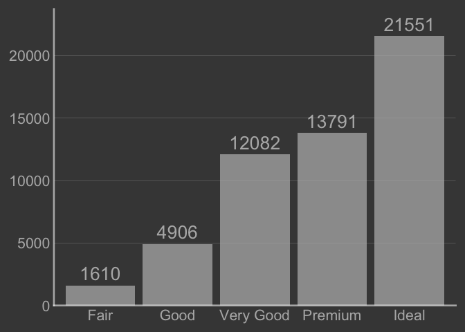

<!-- README.md is generated from README.Rmd. Please edit that file -->

# ggpro

<!-- badges: start -->
<!-- badges: end -->

The goal of ggpro is to …

## Installation

You can install the development version of ggpro from
[GitHub](https://github.com/) with:

‘You provide the data, tell ggplot2 how to map variables to aesthetics,
what graphical primitives to use, and it takes care of the details.’

But getting to a professional looking plot might involve many details -
and might vary depending on what chart type you are after.

``` r
# install.packages("devtools")
devtools::install_github("EvaMaeRey/ggpro")
```

## Example

This is a basic example which shows you how to solve a common problem:

``` r
library(tidyverse)
#> Warning: package 'ggplot2' was built under R version 4.4.1
#> ── Attaching core tidyverse packages ──────────────────────── tidyverse 2.0.0 ──
#> ✔ dplyr     1.1.4     ✔ readr     2.1.5
#> ✔ forcats   1.0.0     ✔ stringr   1.5.1
#> ✔ ggplot2   4.0.0     ✔ tibble    3.2.1
#> ✔ lubridate 1.9.3     ✔ tidyr     1.3.1
#> ✔ purrr     1.0.2     
#> ── Conflicts ────────────────────────────────────────── tidyverse_conflicts() ──
#> ✖ dplyr::filter() masks stats::filter()
#> ✖ dplyr::lag()    masks stats::lag()
#> ℹ Use the conflicted package (<http://conflicted.r-lib.org/>) to force all conflicts to become errors
```

``` r
# library(ggpro)
## basic example code


#' @export
scale_x_vbar <- function(drop = F, wrap = 15, labels = function(x){stringr::str_wrap(x, wrap)}, ...){
  
    scale_x_discrete(drop = drop, 
                     labels = labels)
  
}    

#' @export
scale_y_vbar <- function(expand = expansion(c(0, .1)), yaxis_title = "", labels = function(x){ifelse(x == max(x, na.rm = T), paste0("\n", x, "\n", yaxis_title), x)}, ...){
 
  scale_y_continuous(expand = expand, labels = labels, ...)
   
}

#' @export
theme_vbar <- function(){
  
  theme(axis.line.x = element_blank(),
             panel.grid.major.x = element_blank(),
             panel.grid.minor.x = element_blank(),
             panel.grid.minor.y = element_blank(),
             panel.grid.major.y = element_line(linewidth = .1),
             axis.title = element_blank(),
             axis.ticks = element_blank(),
             axis.line.x.bottom = element_line())
  
}

#' @export
geom_vbar <- function(yaxis = T, wrap = 15, yaxis_title = "", ...){
  
  list(geom_bar(...),
       theme_vbar(),
       scale_x_vbar(wrap = wrap),
       scale_y_vbar(yaxis_title = yaxis_title),
       NULL
       )
  
}


#' @export
geom_vbar_label <- function(...){
  
  
  statexpress::qlayer(geom = statexpress::qproto_update(GeomLabel,
                                                        aes(vjust = 0, linewidth = 0, fill = NA)),
                      stat = statexpress::qproto_update(StatCount, aes(label = after_stat(count))), 
                      ...                          )
  
}
```

``` r

theme_grey() |> 
  theme_set()


diamonds |> 
  ggplot() + 
  aes(x = cut) + 
  geom_vbar() + 
  geom_vbar_label() 
```


``` r

ggchalkboard:::theme_blackboard() |> 
  theme_set()

last_plot()
```



``` r
  

last_plot() + 
  scale_y_vbar(yaxis_title = "diamonds", limits = c(0, nrow(diamonds)))
#> Scale for y is already present.
#> Adding another scale for y, which will replace the existing scale.
```


``` r

last_plot() + 
  scale_x_vbar(wrap = 6)
#> Scale for x is already present.
#> Adding another scale for x, which will replace the existing scale.
```


``` r
# library(ggpro)
## basic example code


#' @export
scale_y_hbar <- function(drop = F, wrap = 15, labels = function(x){stringr::str_wrap(x, wrap)}, ...){
  
    scale_y_discrete(drop = drop, 
                     labels = labels)
  
}    

#' @export
scale_x_hbar <- function(expand = expansion(c(0, .2)), xaxis_title = "", labels = function(x){ifelse(x == max(x, na.rm = T), paste0(x, "\n", xaxis_title), x)}, ...){
 
  scale_x_continuous(expand = expand, labels = labels, ...)
   
}

#' @export
theme_hbar <- function(){
  
  theme(axis.line.y = element_blank(),
             panel.grid.major.y = element_blank(),
             panel.grid.minor.y = element_blank(),
             panel.grid.minor.x = element_blank(),
             panel.grid.major.x = element_line(linewidth = .1),
             axis.title = element_blank(),
             axis.ticks = element_blank(),
             axis.line.y.left = element_line())
  
}

#' @export
geom_hbar <- function(xaxis = T, wrap = 15, xaxis_title = "", ...){
  
  list(geom_bar(...),
       theme_hbar(),
       scale_y_hbar(wrap = wrap),
       scale_x_hbar(xaxis_title = xaxis_title),
       NULL
       )
  
}


#' @export
geom_hbar_label <- function(...){
  
  
  statexpress::qlayer(geom = statexpress::qproto_update(GeomLabel,
                                                        aes(hjust = 0, linewidth = 0, fill = NA)),
                      stat = statexpress::qproto_update(StatCount, aes(label = after_stat(count))), ...
                                                )
  
}
```

``` r
diamonds |> 
  ggplot() + 
  aes(y = cut) + 
  geom_hbar() + 
  geom_hbar_label() 
```


``` r
#' @export
scale_color_logical <- function(...){
  scale_color_manual(values = c(scales::col_mix(theme_get()$geom@ink, 
                                              theme_get()$geom@paper, .6)
                                              , scales::col_mix(theme_get()$geom@accent, 
                                              theme_get()$geom@paper, .1)), guide = "none")}

#' @export
scale_fill_logical <- function(...){
  scale_fill_manual(values = c(scales::col_mix(theme_get()$geom@ink, 
                                              theme_get()$geom@paper, .7)
                                              , scales::col_mix(theme_get()$geom@accent, 
                                              theme_get()$geom@paper, .2)), guide = "none")
                    }
```

``` r
ggplot(mtcars) + 
  aes(disp, hp, color = cyl == 4) + 
  geom_jitter(size = 6) + 
  scale_color_logical()
```


``` r

theme_classic(paper = "whitesmoke", 
              ink = "gray40", 
              accent = "plum3") |>
  set_theme()

ggplot(mtcars) + 
  aes(cyl, fill = cyl == 8) + 
  geom_vbar() + 
  geom_vbar_label(fill = NA) +
  scale_fill_logical()
```


``` r
aes_y_by_x <- function(x, y){
  
  aes(x = {{x}}, 
      y = interaction(rank(-{{x}}), {{y}}, lex.order = T))
  
}

scale_y_remove_rank_rev <- function(...){
  scale_y_discrete(labels = function(x) str_remove(x, "^\\d+?\\."), 
                 limits = rev, ...)
}
```

``` r
theme_gray() |> theme_set()

gapminder::gapminder |>
  filter(year %in% c(1967, 2007)) |> 
  filter(continent == "Americas") |>
  ggplot() + 
  aes_y_by_x(x = pop, y = country) +
  geom_col() + 
  scale_y_remove_rank_rev() +
  facet_wrap(facets = vars(year), 
             scales = "free_y") 
```


``` r

library(tidyverse)

gapminder::gapminder |>
  filter(year %in% c(1967, 2007)) |> 
  filter(continent == "Americas") |>
  ggplot() + 
  aes(x = pop, y = country) 
```


``` r

last_plot() + 
  aes(y = !!rlang::quo_get_expr(last_plot()$mapping$x))
```


``` r


re_map_aes_y_by_x <- function() {
  structure(list(), 
            class = "re_map_aes_y_by_x")
}

#' @export
ggplot_add.re_map_aes_y_by_x <- function(object, plot, object_name) {
  
  plot + aes_y_by_x(y = !!rlang::quo_get_expr(plot$mapping$y),
                    x = !!rlang::quo_get_expr(plot$mapping$x))
    
}


gapminder::gapminder |>
  filter(year %in% c(1967, 2007)) |> 
  filter(continent == "Americas") |>
  ggplot() + 
  aes(x = pop, y = country) +
  re_map_aes_y_by_x() + 
  geom_col() + 
  scale_y_remove_rank_rev() + 
  facet_wrap(~year, scales = "free_y")
```


``` r


  
geom_col_ranked <- function(...){
  
  list(geom_col(...),
       re_map_aes_y_by_x(),
       scale_y_remove_rank_rev(),
       theme(panel.grid.minor.y = element_blank(),
             panel.grid.major.y = element_blank()),
       labs(y = NULL))
  
}


gapminder::gapminder |>
  filter(year %in% c(1967, 2007)) |> 
  filter(continent == "Americas") |>
  mutate(pop_millions = pop/1000000) ->
americas_pop_2years
  
ggplot(americas_pop_2years) + 
  aes(x = pop_millions, y = country) +
  geom_col_ranked() +
  facet_wrap(~year, scales = "free_y")
```


``` r


theme_grey(accent = "slateblue") |> set_theme()

last_plot() + 
  ggplyr::data_slice_max(pop, n = 5, by = year) + 
  aes(fill = country == "Argentina") + 
  scale_fill_logical() 
```


``` r


ggchalkboard:::theme_chalkboard() |> set_theme()

last_plot() + 
  scale_fill_logical()
#> Scale for fill is already present.
#> Adding another scale for fill, which will replace the existing scale.
```


``` r
knitrExtra::chunk_to_dir(c("geom_vbar", "geom_hbar", "scale_color_logical"))
usethis::use_package("stringr")
usethis::use_package("ggplot2")
devtools::document()
devtools::check(".")
devtools::install(".", upgrade = "never")
```
